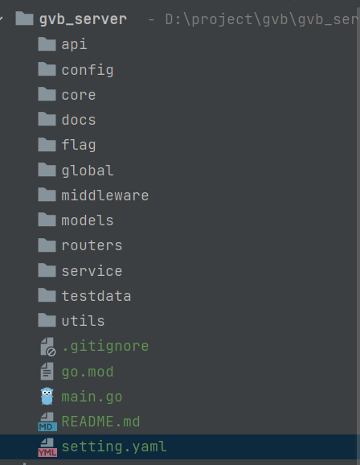
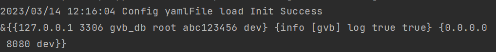

# gvb后端
## 新建项目，配置代理
```bash
GOPROXY=https://goproxy.cn,direct
```
## 项目结构

## 项目配置
### 配置文件
```yaml
// setting.yaml
mysql:
  host: 127.0.0.1
  port: 3306
  db: gvb_db
  user: root
  password: abc123456
  log_level: dev
logger:
  level: info
  prefix: '[gvb]'
  director: log
  show_line: true
  log_in_console: true
system:
  host: '0.0.0.0'
  port: 8080
  env: dev
```
### 配置文件读取
```go
// config/enter.go
type Config struct {
	Mysql  Mysql  `yaml:"mysql"`
	Logger Logger `yaml:"logger"`
	System System `yaml:"system"`
}
// config/conf_system.go
type System struct {
    Host string `yaml:"host"`
    Port string `yaml:"port"`
    Env  string `yaml:"env"`
}
// config/conf_mysql.go
type Mysql struct {
    Host     string `yaml:"host"`
    Port     int    `yaml:"port"`
    DB       string `yaml:"db"`
    User     string `yaml:"user"`
    Password string `yaml:"password"`
    LogLevel string `yaml:"log_level"`
}
// config/conf_logger.go
package config

type Logger struct {
    Level        string `yaml:"level"`
    Prefix       string `yaml:"prefix"`
    Director     string `yaml:"director"`
    ShowLine     bool   `yaml:"show_line"`
    LogInConsole bool   `yaml:"log_in_console"` // 是否显示打印路径
}
```
安装读取yaml文件的包 `go get gopkg.in/yaml.v2`
```go
// core/conf.go
package core

import (
	"fmt"
	"gopkg.in/yaml.v2"
	"gvb_server/config"
	"gvb_server/global"
	"io/ioutil"
	"log"
)

func InitConf() {
	const ConfigFile = "setting.yaml"
	c := &config.Config{}
	yamlConf, err := ioutil.ReadFile(ConfigFile)
	if err != nil {
		panic(fmt.Errorf("get yamlConf Error: %s", err))
	}
	err = yaml.Unmarshal(yamlConf, c)
	if err != nil {
		log.Fatalf("Config Init Unmarshal Error: %v", err)
	}
	log.Println("Config yamlFile load Init Success")
	global.Config = c
}
// 将config放在全局
// global/global.go
package global

import "gvb_server/config"

var (
	Config *config.Config
)
```
在main.go导入后，运行程序。成功打印出配置信息
```go
func main() {
	core.InitConf()
	fmt.Println(global.Config)
}
```

### gorm配置
```go
// config/conf_mysql.go
func (m Mysql) Dsn() string {
  return m.User + ":" + m.Password + "@tcp(" + m.Host + ":" + strconv.Itoa(m.Port) + ")/" + m.DB + "?" + m.Config
}

// core/gorm.go
package core

import (
	"fmt"
	"gorm.io/driver/mysql"
	"gorm.io/gorm"
	"gorm.io/gorm/logger"
	"gvb_server/global"
	"log"
	"time"
)

func InitGorm() *gorm.DB {
	return MysqlConnect()
}

func MysqlConnect() *gorm.DB {
	if global.Config.Mysql.Host == "" {
		log.Println("未配置MySQL，取消gorm连接")
		return nil
	}
	dsn := global.Config.Mysql.Dsn()
	var mysqlLogger logger.Interface
	if global.Config.System.Env == "debug" {
		mysqlLogger = logger.Default.LogMode(logger.Info)
	} else {
		mysqlLogger = logger.Default.LogMode(logger.Error)
	}
	db, err := gorm.Open(mysql.Open(dsn), &gorm.Config{
		Logger: mysqlLogger,
	})
	if err != nil {
		log.Fatalf(fmt.Sprintf("[%s] mysql连接失败", err))
		panic(err)
	}
	sqlDB, _ := db.DB()
	sqlDB.SetMaxIdleConns(10)               // 最大空闲连接数
	sqlDB.SetMaxOpenConns(100)              // 最多可容纳
	sqlDB.SetConnMaxLifetime(time.Hour * 4) // 连接最大复用时间
	return db
}

```
### 日志配置

安装`go get github.com/sirupsen/logrus`
```go
// core/logrus.go
package core

import (
	"bytes"
	"fmt"
	"github.com/sirupsen/logrus"
	"gvb_server/global"
	"os"
	"path"
)

const (
	red    = 31
	yellow = 33
	blue   = 36
	gray   = 37
)

type LogFormatter struct {
}

func (f *LogFormatter) Format(entry *logrus.Entry) ([]byte, error) {
	// 根据不同level展示颜色
	var levelColor int
	switch entry.Level {
	case logrus.DebugLevel, logrus.TraceLevel:
		levelColor = gray
	case logrus.WarnLevel:
		levelColor = yellow
	case logrus.ErrorLevel, logrus.FatalLevel, logrus.PanicLevel:
		levelColor = red
	default:
		levelColor = blue
	}

	// 设置buffer 缓冲区
	var b *bytes.Buffer
	if entry.Buffer == nil {
		b = &bytes.Buffer{}
	} else {
		b = entry.Buffer
	}
	log := global.Config.Logger
	// 自定义日期格式
	timestamp := entry.Time.Format("2006-01-02 15:04:05")
	if entry.HasCaller() {
		funcVal := entry.Caller.Function
		fileVal := fmt.Sprintf("%s:%d", path.Base(entry.Caller.File), entry.Caller.Line)
		fmt.Fprintf(b, "[%s][%s] \x1b[%dm[%s]\x1b[0m %s %s %s\n", log.Prefix, timestamp, levelColor, entry.Level, fileVal, funcVal, entry.Message)
	} else {
		fmt.Fprintf(b, "[%s][%s] \x1b[%dm[%s]\x1b[0m %s\n", log.Prefix, timestamp, levelColor, entry.Level, entry.Message)
	}
	return b.Bytes(), nil
}

func InitLogger() *logrus.Logger {
	mLog := logrus.New()
	mLog.SetOutput(os.Stdout)
	mLog.SetReportCaller(global.Config.Logger.ShowLine)
	mLog.SetFormatter(&LogFormatter{})
	level, err := logrus.ParseLevel(global.Config.Logger.Level)
	if err != nil {
		level = logrus.InfoLevel
	}
	mLog.SetLevel(level)
	InitDefaultLogger()
	return mLog
}

func InitDefaultLogger() {
	logrus.SetOutput(os.Stdout)
	logrus.SetReportCaller(global.Config.Logger.ShowLine)
	logrus.SetFormatter(&LogFormatter{})
	level, err := logrus.ParseLevel(global.Config.Logger.Level)
	if err != nil {
		level = logrus.InfoLevel
	}
	logrus.SetLevel(level)
}


```
### 路由配置
安装`go get github.com/gin-gonic/gin`
```go
// config/conf_system.go
func (s System) Addr() string {
  return fmt.Sprintf("%s:%v", s.Host, s.Port)
}
// routers/enter.go
package routers

import (
	"github.com/gin-gonic/gin"
	"gvb_server/global"
)

func InitRouter() *gin.Engine {
	gin.SetMode(global.Config.System.Env)
	router := gin.Default()
	router.GET("", func(ctx *gin.Context) {
		ctx.String(200, "xxx")
	})
	return router
}

```